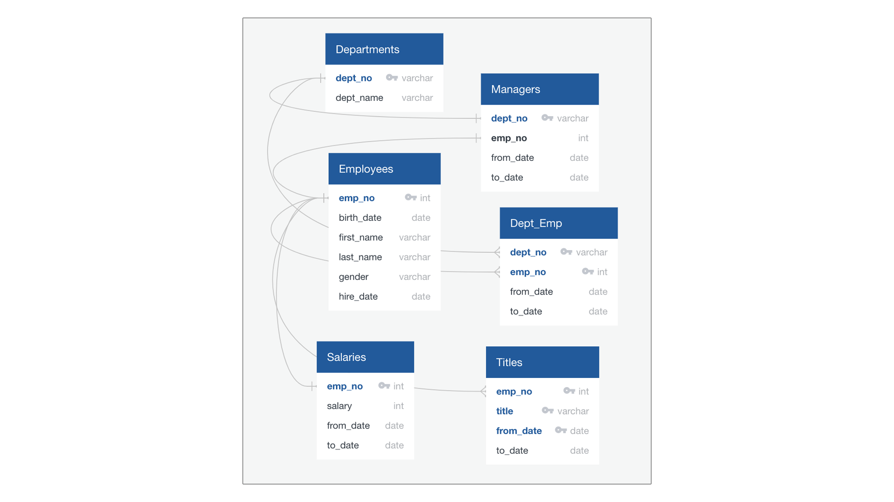
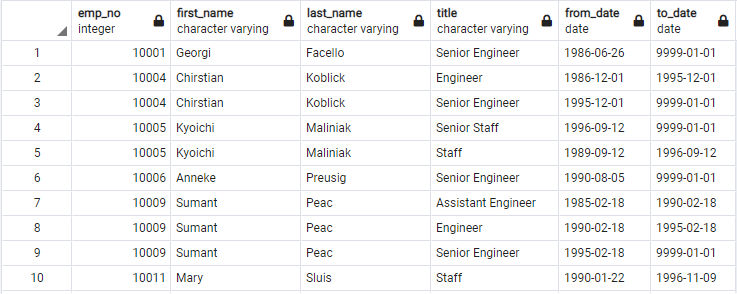
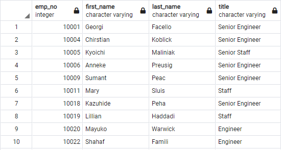
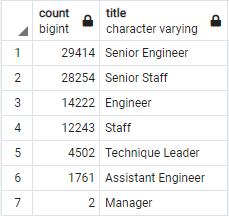
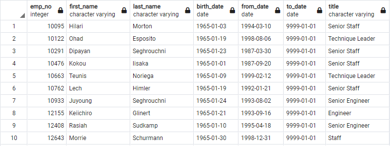

# Pewlett-Hackard Analysis

## Project Overview
The purpose of this analysis is to prepare Pewlett-Hackard, a large company with several thousand employees, for the upcoming "silver tsunami". A large number of employees will begin to retire at a rapid rate and the company wants to be prepared with retirement packages and what positions will need to be filled in the near future.
This analysis includes:
1. The retiring employees by title
2. The number of retiring employees grouped by title
3. The employees eligible for the mentorship program 
4. The number of rolls to fill grouped by title and department
5. The number of qualified, retirement-ready employees to mentor the next generation grouped by title and department

## Resources

## ERD
Using Quick DBD to create a map of the database. This map will show us each table in the database and the flow of data from one table to another.

  

<i> Figure 1: ERD
  </i>

## Results
1. List of retiring employees by their title (including duplicates)
- The table includes employee number, first name, last name, title, from-date and to-date.
- The query returns 133,776 rows.
- The table displays a list of employees who are going to retire in the next few years.
- The list is long and extensive, yet at-a-glance analysis gives us some insight. Some employees appear more than once due to change of title during their career at Pewlett-Hackard.

  

 
<i>Figure 2: Table with the employee’s data that are retirement-ready (duplicates included)
  </i>

2. The list of retiring employees without duplicates
- The table includes employee number, first name, last name and title.
- The query returns 90, 398 rows.
- The table gives us an accurate represention of employees who are going to retire in the next few years.
- In the table each employee is listed only once, by his or her most recent title.

  

 
<i>Figure 2: Table with the employee’s data that are retirement-ready (no duplicates)
  </i>

3. The number of retiring employees grouped by title.
 

- The table includes employees’ titles and the count of each title.
- From this table we can quickly see how many employees with each title will retire in the next few years.

  

 
<i>Figure 3: Table with the sum of retiring employees grouped by title
  </i>

4. List of Employees Eligible for the Mentorship Program. 
- The table contains employee number, first name, last name, birth date, from date, to date and title.
- The query returns 1,549 rows.
- The table displays a list of employees who are eligible for the mentorship program. Current employees who were born between January 1, 1965 and December 31, 1965.

  

 
<i>Figure 4: Table with the employees eligible for the Mentorship Program
  </i>

## Summary

#### How many roles will need to be filled as the "silver tsunami" begins to make an impact?

90,398 roles will need to be filled as the "silver tsunami" begins to make an impact as these are the number of employees that would be ready for retirement. 

#### Are there enough qualified, retirement-ready employees in the departments to mentor the next generation of Pewlett Hackard employees?

Based on the list of employees eligible for the Mentorship Program, there are only 1,549 retirement-ready employees in the departments to mentor the next generation of Pewlett Hackard employees.

